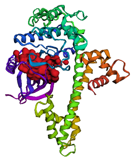

# Pocket Analysis of TgCDPK1

## Project Summary

This project investigates the stability and behavior of a ligand-binding pocket in the TgCDPK1 protein. The protein initially contained a bound ligand, which was removed prior to molecular dynamics (MD) simulations. Structural and pocket changes were analyzed throughout the trajectory using Fpocket, MDpocket, GROMACS, and Python-based tools.

## Tools Used

- GROMACS – MD simulations
- Fpocket – Static pocket detection
- MDpocket – Pocket tracking over time
- Python (pandas, matplotlib) – Data processing and plotting

## Analysis Workflow

1. Prepare protein structure and topology
2. Run MD simulation using GROMACS
3. Detect static pockets with Fpocket
4. Track pocket volume and descriptors using MDpocket
5. Analyze:
   - RMSD
   - RMSF
   - SASA
   - Radius of Gyration
6. Visualize results in `plots/`
7. Summarize findings in the final report

---

## Main Directory Structure

### Root Files

- `Report.pdf` – Summary and figures
- `plots.ipynb` – Jupyter Notebook for analysis and visualization

### Directories

- `Fpocket/` – Output files from static Fpocket analysis
- `MDpocket/` – Outputs from pocket tracking during MD
- `GROMACS_inp_out/` – Selected input and output files from MD simulation
- `PDB_files/` – Protein structure files used in the workflow

---

## Command Logs & Protocols

- `Commands_Fpocket.pdf` – Static pocket detection steps
- `Commands_GROMACS_MD_Run.docx/.pdf` – Commands used for MD simulation
- `Commands_GROMACS_MD_Analysis.docx/.pdf` – Commands for post-MD analyses

---

## Excel Output Files

- `area.xlsx` – Solvent-accessible surface area (SASA)
- `gyrate.xlsx` – Radius of Gyration
- `mdpout_descriptors.xlsx` – Pocket descriptors from MDpocket
- `rmsd_pocket.xlsx` – RMSD for the pocket
- `rmsf_pocket.xlsx` – RMSF for pocket residues

---

## Interpretation

The simulation and pocket tracking revealed structural reorganization in the binding pocket following ligand removal. Descriptors such as pocket volume, hydrophobicity, and druggability were monitored. 

---

For further information, refer to the full report or contact the project author.
